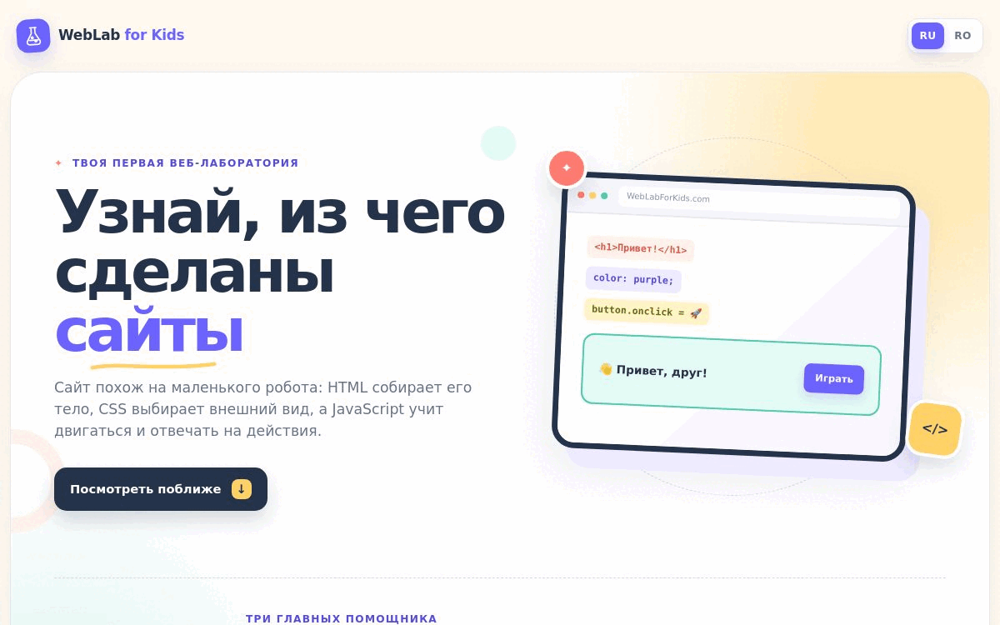
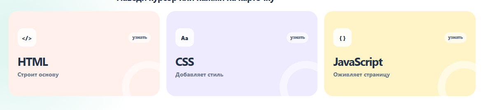
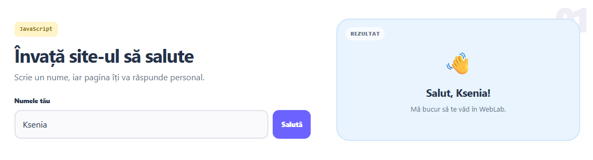
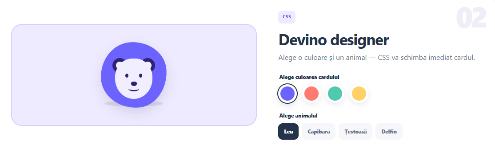
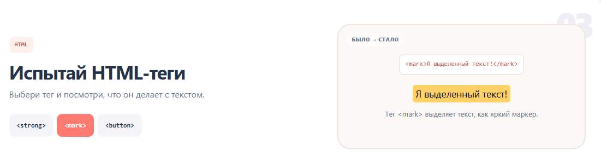
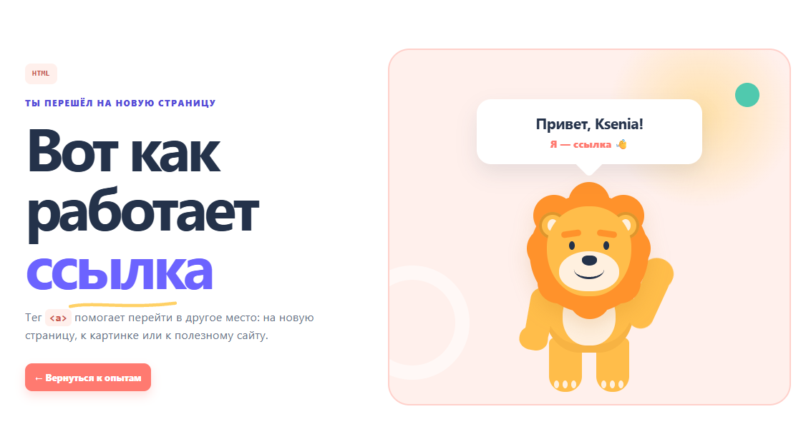
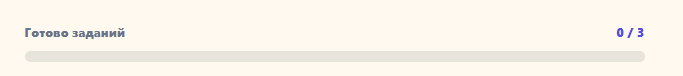

<h1>🧪 WebLab for Kids</h1>

<strong>Интерактивная веб-лаборатория, в которой дети знакомятся с HTML, CSS и JavaScript через игру.</strong>

  
  
  

  
  
  
  

  <a href="#публикация-на-github-pages"><strong>GitHub Pages</strong></a>
  ·
  <a href="#все-интерактивные-возможности"><strong>Все интерактивы</strong></a>

> [!IMPORTANT]
> **Ссылка на сайт:** [Открыть WebLab for Kids](https://chernichka03.github.io/WebLab-for-Kids/)

## О проекте

WebLab for Kids — учебный сайт для детей примерно 8–12 лет. Вместо длинных определений ребёнок сразу видит, что делает каждая веб-технология:

- **HTML** строит основу страницы;
- **CSS** добавляет цвет, форму и расположение;
- **JavaScript** отвечает на действия пользователя и меняет страницу.

На сайте есть три настоящих задания, мгновенная обратная связь, сохранение прогресса, отдельная демонстрационная страница и полная версия интерфейса на русском и румынском языках.

## Ключевые особенности

| Возможность | Что получает ребёнок |
| --- | --- |
| Обучение через действие | Каждый термин сразу можно проверить кликом, вводом текста или выбором варианта. |
| Дружелюбный интерфейс | Крупные элементы, короткие объяснения, спокойная анимация и понятная цветовая система. |
| Персонализация | Сайт запоминает имя и использует его в приветствии на главной и на отдельной странице. |
| Видимый результат | Шкала `0 / 3` показывает, сколько заданий уже выполнено. |
| Два языка | Весь интерфейс переключается между `RU` и `RO` без перезагрузки. |
| Работа без сервера | Проект запускается обычным открытием `index.html` и подходит для GitHub Pages. |

## Визуальный тур

### 1. Главная страница

Главный экран коротко знакомит с HTML, CSS и JavaScript. Кнопка **«Играть»** ведёт сразу к лаборатории, а **«Посмотреть поближе»** — к карточкам технологий. Значок колбы в шапке реагирует на наведение: увеличивается, а пузырьки внутри начинают двигаться.

### 2. Карточки технологий

Карточки раскрываются при наведении, фокусе с клавиатуры или тапе. На компьютере они стоят в одну линию, а на телефоне превращаются в удобный вертикальный список.

### 3. Персональное приветствие

Ребёнок вводит имя и нажимает **«Поздороваться»**. JavaScript меняет приветствие, запускает анимацию руки и отмечает первое задание выполненным. Пустое поле возвращает нейтральное приветствие «Привет, друг!».

### 4. Цветная карточка с животными

Можно выбрать один из четырёх цветов и одного из четырёх персонажей: льва, капибару, черепаху или дельфина. Цвет карточки, животного, глаз и декоративных деталей пересчитывается через CSS-переменные. Готовые маски животных встроены прямо в `styles.css`, поэтому для переключения не требуется загружать отдельный файл и картинка появляется сразу целиком.

### 5. Настоящие HTML-теги

В третьем опыте ребёнок выбирает тег и сразу видит три вещи: исходный код, результат в браузере и простое объяснение. Демонстрационная кнопка отвечает эффектом с искрами, а ссылка открывает отдельную страницу с машущим CSS-львом.

### 6. Переход по ссылке

После выбора ссылки в задании открывается отдельная страница. Она наглядно показывает переход и приветствует ребёнка по сохранённому имени.

### 7. Прогресс

Прогресс сохраняется между главной страницей и `link.html`. После результата `3 / 3` появляется финальный блок. Кнопка **«Пройти ещё раз»** очищает имя и задания, но сохраняет выбранный язык.

## Все интерактивные возможности

| Где | Действие | Что происходит | Что демонстрирует |
| --- | --- | --- | --- |
| Шапка | Навести курсор или поставить фокус на колбу | Значок увеличивается, пузырьки двигаются как во время реакции | CSS-анимации |
| Шапка | Выбрать `RU` или `RO` | Все заголовки, подписи, подсказки и сообщения меняют язык без перезагрузки | JavaScript + локализация |
| Главный экран | Нажать **«Играть»** | Страница плавно переходит к опытам | Якорная навигация |
| Главный экран | Нажать **«Посмотреть поближе»** | Страница переходит к трём карточкам технологий | Якорная навигация |
| Карточки HTML/CSS/JS | Навести, нажать или выбрать с клавиатуры | Открывается детское объяснение технологии | Интерактивные состояния CSS/JS |
| Опыт №1 | Ввести имя и нажать **«Поздороваться»** | Приветствие становится персональным, рука машет, задание засчитывается | Работа с полем ввода и DOM |
| Опыт №2 | Выбрать цвет | Меняется фон карточки и палитра персонажа | CSS-переменные |
| Опыт №2 | Выбрать животное | На карточке появляются лев, капибара, черепаха или дельфин | Смена состояния без перезагрузки |
| Опыт №3 | Выбрать `<strong>` | Текст становится важным и жирным | Семантический HTML |
| Опыт №3 | Выбрать `<mark>` | Текст выделяется как маркером | HTML-выделение |
| Опыт №3 | Выбрать `<button>` | Появляется настоящая кнопка; клик запускает искры и сообщение | HTML + событие `click` |
| Опыт №3 | Выбрать `<a>` | Появляется ссылка на отдельную страницу | Навигация HTML |
| Страница ссылки | Открыть `link.html` | CSS-лев машет лапой и приветствует ребёнка по сохранённому имени | Ссылка, CSS-рисунок и `localStorage` |
| Страница ссылки | Нажать **«Вернуться к опытам»** | Возврат в лабораторию без потери прогресса | Сохранение состояния |
| Финал | Нажать **«Пройти ещё раз»** | Имя и все три задания очищаются; язык остаётся выбранным | Управление локальными данными |

## Как устроены три задания

### Задание 1 — JavaScript слышит ребёнка

1. Считывает текст из поля имени.
2. Безопасно подставляет имя в приветствие через `textContent`.
3. Сохраняет имя в `localStorage`.
4. Добавляет задание `name` в список выполненных.
5. Обновляет шкалу прогресса.

### Задание 2 — CSS меняет внешний вид

1. Цветные кнопки задают активную палитру.
2. Кнопки животных меняют выбранный персонаж.
3. CSS-переменные создают контрастные оттенки для фона, глаз, панциря и деталей.
4. Капибара, черепаха и дельфин используют готовые PNG-маски, встроенные в таблицу стилей и окрашиваемые в выбранный цвет.
5. Первый выбор засчитывает задание `color`.

### Задание 3 — HTML создаёт элементы

1. Выбор тега меняет пример кода.
2. Рядом обновляется настоящий результат.
3. Под результатом появляется объяснение простыми словами.
4. Для `<button>` доступен дополнительный эффект по клику.
5. Для `<a>` открывается полноценная вторая страница.

## Локализация RU / RO

Тексты вынесены в словари файла [`i18n.js`](./i18n.js). Переключатель языка:

- обновляет элементы с атрибутом `data-i18n`;
- меняет доступные подписи `aria-label`;
- обновляет динамические сообщения заданий;
- сохраняет выбор в `weblab-language`;
- работает одинаково на `index.html` и `link.html`.

## Сохранение данных и приватность

Сайт не отправляет имя ребёнка на сервер. Данные остаются только в локальном хранилище текущего браузера.

| Ключ | Что хранит |
| --- | --- |
| `weblab-language` | выбранный язык `ru` или `ro` |
| `weblab-kid-name` | введённое имя |
| `weblab-completed-tasks` | выполненные задания `name`, `color`, `tag` |

Если открыть сайт на другом устройстве или очистить данные браузера, прогресс начнётся заново.

