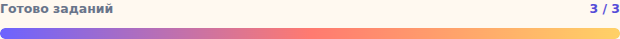
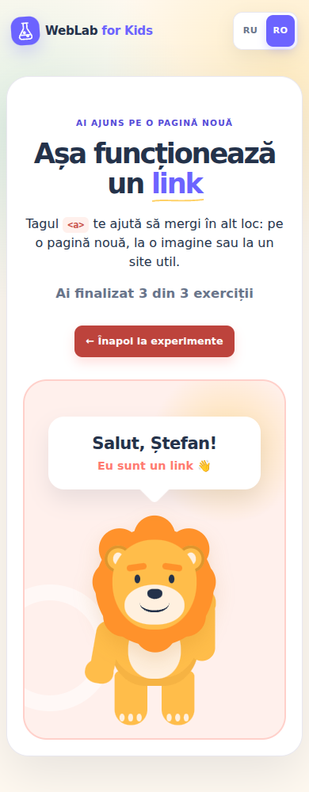

# WebLab for Kids

Интерактивный учебный сайт для детей примерно 8–12 лет. Проект объясняет три базовые технологии веб-разработки через короткие эксперименты:

- HTML создаёт элементы страницы;
- CSS меняет их внешний вид;
- JavaScript добавляет поведение, состояние и реакцию на действия пользователя.

[Открыть WebLab for Kids](https://chernichka03.github.io/WebLab-for-Kids/)

## Что умеет сайт

Пользователь проходит три задания и видит общий прогресс `0 / 3`:

1. вводит имя и получает персональное приветствие;
2. выбирает цвет и животное для карточки дизайнера;
3. пробует четыре HTML-тега, а затем переходит на отдельную страницу по ссылке.

После прохождения задания его статус меняется на «Готово». Имя, язык, выбранное оформление, попробованные варианты и прогресс сохраняются после перезагрузки и перехода между страницами.

## Как устроен интерфейс

### Главный экран

Главный экран знакомит с проектом и содержит карточки HTML, CSS и JavaScript. Карточки раскрываются наведением, кликом или клавиатурой. Кнопка «Посмотреть поближе» прокручивает пользователя к объяснениям, а кнопка «Играть» — к заданиям.


### Прогресс

В начале пользователь видит `0 / 3`. Полоса и подпись обновляются после успешного завершения каждого опыта.



### Задание 1: персональное приветствие

JavaScript читает значение поля, очищает пробелы по краям и показывает имя в результате. Пустое поле не засчитывает задание и выводит подсказку. В результате есть кнопка «Как это работает?»: она открывает короткий пример кода с текущим приветствием. Пример доступен мышью, касанием, Enter, Space и закрывается клавишей Escape.


### Задание 2: дизайнер

Пользователь выбирает четыре цвета и четыре животных. Для завершения достаточно попробовать восемь разных вариантов: четыре цвета и четыре животных. Все сочетания перебирать не нужно. Животные переключаются без загрузки дополнительных изображений: маски встроены в CSS как WebP-данные.


### Задание 3: HTML-теги

Пользователь знакомится с `<strong>`, `<mark>`, `<button>` и `<a>`. Справа отображаются исходный пример и результат. Кнопка реагирует на нажатие, а ссылка открывает `link.html`. Ранний переход не завершает задание: сначала нужно попробовать остальные теги, затем перейти по ссылке ещё раз.


### Отдельная страница ссылки

`link.html` показывает, что ссылка действительно может открыть другую страницу. На ней сохраняются имя, язык и прогресс, а пользователь видит приветствие и кнопку возврата к опытам.


### Мобильная версия

Интерфейс рассчитан на ширины от 320 px. Сетка перестраивается, кнопки увеличиваются до удобного размера, а раскрывающиеся блоки работают касанием.

<p>
  
  
  
</p>

## Технологический стек

- HTML5 — структура двух страниц и семантические элементы;
- CSS3 — адаптивная сетка, переменные цветов, состояния, анимации и маски животных;
- Vanilla JavaScript — задания, локализация, прогресс, доступность и сохранение состояния;
- `localStorage` — локальное сохранение данных без сервера;
- GitHub Pages — публикация статического сайта без сборщика и базы данных.

Внешние библиотеки, CDN, шрифты, аналитика и серверные запросы не используются.

## Структура проекта

```text
WebLab-for-Kids/
├── index.html              # главная страница и три задания
├── link.html               # отдельная страница, открываемая через <a>
├── styles.css              # дизайн, адаптивность и CSS-анимации
├── script.js               # события интерфейса и логика заданий
├── state.js                # модель состояния и синхронизация localStorage
├── i18n.js                 # словари русского и румынского языков
├── link-page.js            # логика страницы link.html
├── favicon.svg             # иконка вкладки
├── assets/                 # исходные изображения масок животных
├── docs/
│   ├── screenshots/        # изображения, используемые в README
│   ├── qa-results.json     # результат полного браузерного теста
│   └── qa-update.json      # дополнительные результаты проверки
└── tests/
    ├── state.test.cjs      # тесты модели состояния
    └── browser.cjs         # браузерные сценарии и генерация скриншотов
```

## Как работает состояние

Вся логика состояния собрана в `state.js`. Основное состояние содержит:

| Поле | Назначение |
| --- | --- |
| `name` | Имя пользователя для приветствия на обеих страницах. |
| `language` | Текущий язык: `ru` или `ro`. |
| `completedTasks` | Выполненные задания: `name`, `color`, `tag`. |
| `triedColors` | Уникальные цвета, которые пользователь попробовал. |
| `triedAnimals` | Уникальные животные, которые пользователь попробовал. |
| `triedTags` | Уникальные HTML-теги, которые пользователь выбрал. |
| `currentColor` | Последний выбранный цвет. |
| `currentAnimal` | Последнее выбранное животное. |
| `currentTag` | Последний выбранный HTML-тег. |

Состояние хранится под ключом `weblab-state-v1`, язык — под ключом `weblab-language`. При старом формате данных `state.js` выполняет миграцию. Повреждённое или недоступное хранилище не ломает сайт: интерфейс продолжает работать и сообщает об ограничении.

Изменения состояния уведомляют другие открытые вкладки через событие `storage`, поэтому имя, язык и прогресс синхронизируются между вкладками.

## Как работают задания

### Имя

Обработчик формы проверяет поле, сохраняет нормализованное имя и обновляет результат через `textContent`. Это важно для безопасности: строка вроде `<b>Ana</b>` показывается как обычный текст, а не выполняется как HTML.

### Дизайн

Цвет и животное выбираются отдельными кнопками с `aria-pressed`. CSS-переменные меняют фон, контрастные детали и цвет персонажа. Для капибары, дельфина и черепахи используются встроенные маски, поэтому после загрузки CSS отдельный сетевой запрос не нужен.

### HTML-теги

Кнопки тегов обновляют пример кода и безопасный результат. После выбора всех четырёх тегов и перехода по `<a>` задание помечается выполненным. Кнопка `<button>` демонстрирует интерактивное событие, а ссылка связывает `index.html` и `link.html`.

## Локализация

`i18n.js` содержит русские и румынские тексты. Переключатель языка обновляет заголовки, описания, подписи кнопок и полей, сообщения заданий, статусы прогресса и доступные подписи `aria-label`. Язык меняется без перезагрузки и сохраняется между страницами.

## Данные и приватность

Сайт не имеет регистрации и не отправляет имя ребёнка или прогресс на сервер. Данные остаются в `localStorage` текущего браузера. На другом устройстве прогресс начинается отдельно; очистка данных браузера сбрасывает сохранение.

## Где менять проект

- тексты и порядок блоков — `index.html`;
- цвета, размеры, сетка и анимации — `styles.css`;
- события заданий — `script.js`;
- сохранение и миграция состояния — `state.js`;
- русский и румынский тексты — `i18n.js`;
- вторая страница и приветствие со львом — `link.html` и `link-page.js`;
- README-изображения — `docs/screenshots/`.

Учиться веб-разработке можно с первого клика ✨
