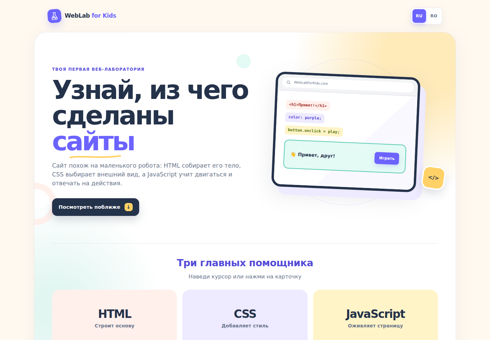
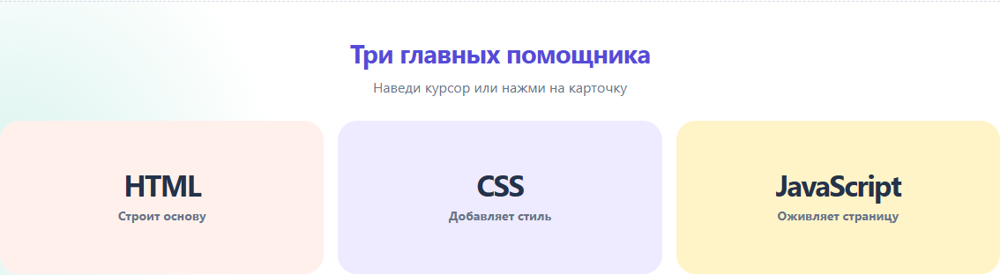
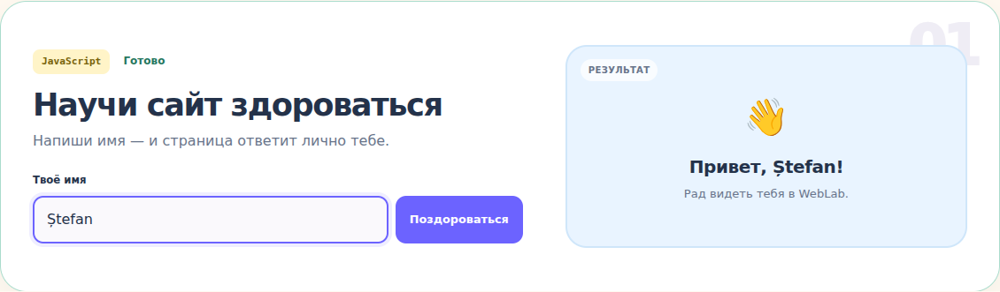
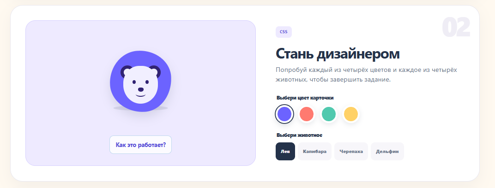
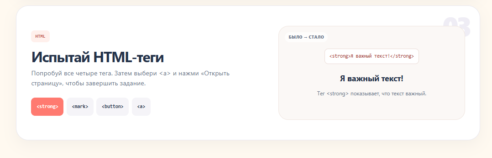
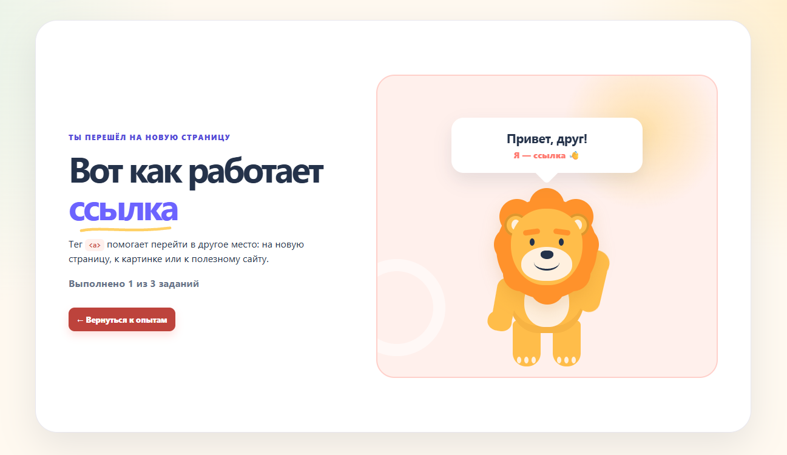

# WebLab for Kids

Интерактивный учебный сайт для детей примерно 8-12 лет. Три коротких опыта показывают, как HTML создаёт элементы, CSS меняет их оформление, а JavaScript отвечает на действия.

**HTML · CSS · JavaScript · RU / RO · адаптивная вёрстка · без зависимостей для работы сайта**

[Открыть WebLab for Kids]([dist/index.html](https://chernichka03.github.io/WebLab-for-Kids/dist/index.html))



## Что можно попробовать

| Раздел | Действие и результат |
| --- | --- |
| Карточки HTML / CSS / JavaScript | Наведение, нажатие или фокус раскрывают короткое объяснение. Escape закрывает его. |
| Приветствие | Ввести имя или ник. Сайт обращается по имени на обеих страницах. Пустое поле показывает подсказку и не засчитывает задание. Наведение на результат или кнопка «Как это работает?» раскрывает короткий пример JavaScript с текущим приветствием; на телефоне используется нажатие, с клавиатуры Enter/Space и Escape. |
| Дизайнер | Попробовать каждый из четырёх цветов и каждого из четырёх животных. Для «Готово» достаточно восьми разных кнопок; все 16 сочетаний перебирать не требуется. Наведение на результат или кнопка «Как это работает?» показывает короткий пример CSS. |
| HTML-теги | Сравнить код и результат для `<strong>`, `<mark>`, `<button>` и `<a>`. Кнопка реагирует на нажатие. «Готово» появляется только после выбора всех четырёх тегов и последующего перехода по ссылке. Ранний переход не засчитывается: нужно попробовать остальные теги и перейти ещё раз. Порядок знакомства с первыми тремя тегами свободный. |
| Прогресс | Видеть результат `0 / 3`, отметки выполненных опытов и финальный блок. Повторное прохождение сбрасывает имя, задания и выбранные варианты; язык остаётся. |
| RU / RO | Переключать язык на любой странице, включая заголовки, пояснения, сообщения и доступные подписи. |

## Что обновлено
- Убраны оранжевый круг со звездой, три цветные точки над примером и декоративные символы перед заголовками. Остался квадрат `</>`. Верхняя панель стала светлой строкой с лупой.
- Сохранены палитра, карточки, CSS-иллюстрации и лев без хвоста.
- На странице ссылки убраны отдельная метка HTML и зелёный декоративный кружок над львом.
- Заголовок над карточками HTML/CSS/JavaScript выровнен по центру и набран обычным регистром; инструкция отделена от него спокойным размером текста и отступом.
- Имя, прогресс, цвет, животное и выбранный тег сохраняются вместе. Возврат, перезагрузка и переключение языка не сбрасывают выбор.
- Состояние синхронизируется между открытыми вкладками. Имя и выбранное оформление из старой версии сохраняются. Отметки второго и третьего заданий, полученные одним нажатием, пересчитываются по новым условиям.
- Добавлены проверка пустого имени, корректная обработка недоступного хранилища, доступные статусы и удобные размеры элементов управления.
- Исправлено размещение длинного румынского заголовка на странице ссылки.
- Прогресс каждого цвета, животного и тега сохраняется после перезагрузки и между страницами; повторное прохождение очищает все попытки.
- В результаты приветствия и дизайнера добавлены короткие примеры JavaScript и CSS с переключением наведением, нажатием и клавиатурой.

## Оптимизация

Три встроенные маски животных переведены из PNG в **WebP без потери качества**: суммарно **27 984 → 15 492 байта**, на **44,6% меньше** до кодирования Base64. Альфа-канал каждой маски проверен попиксельно: изменённых пикселей нет.

Маски остаются внутри CSS: они готовы после загрузки стилей, и при переключении животных дополнительных запросов нет. Исходные PNG сохранены в `dist/assets/` для последующего редактирования; сайт их не загружает. Главная иллюстрация и оба льва выполнены через HTML/CSS, поэтому им не нужны тяжёлые изображения.

Суммарный несжатый объём HTML, CSS и JavaScript главной страницы (с новой иконкой) уменьшился с 113 713 до 110 399 байт. Это сокращение объёма ресурсов, а не обещание ускорения на столько же процентов: время загрузки зависит от сети и кеша.

Сайт не загружает внешние библиотеки, шрифты, аналитику или CDN-ресурсы. Скрипты подключены с `defer`. Анимации учитывают `prefers-reduced-motion`. Скриншоты из README не входят в загрузку страниц сайта.

## Запуск

Распакуйте архив. Для просмотра можно открыть **`dist/index.html`**. Для предсказуемого сохранения между страницами используйте локальный HTTP-сервер: поведение `localStorage` при открытии через `file://` зависит от браузера.

Если установлен Python, из корня проекта выполните:

```bash
python -m http.server 8000 --directory dist
```

Откройте [локальный сайт](http://localhost:8000). В Windows также можно использовать команду `py -m http.server 8000 --directory dist` или расширение Live Server для VS Code.

Установка Node.js и сборка для работы сайта не требуются.

## Основные файлы

| Файл | Назначение |
| --- | --- |
| [dist/index.html](dist/index.html) | Главная страница: объяснения и три интерактивных опыта. |
| [dist/link.html](dist/link.html) | Пример перехода по ссылке с приветствием, львом и прогрессом. |
| [dist/styles.css](dist/styles.css) | Вёрстка, цвета, адаптивность, анимации и встроенные маски животных. |
| [dist/i18n.js](dist/i18n.js) | Словари RU/RO, переключение языка и переводы доступных подписей. |
| [dist/state.js](dist/state.js) | Проверка, сохранение, перенос старых данных и синхронизация состояния. |
| [dist/script.js](dist/script.js) | Обработчики заданий, вывод результатов и повторное прохождение. |
| [dist/link-page.js](dist/link-page.js) | Обращение по имени и прогресс на второй странице. |
| [dist/favicon.svg](dist/favicon.svg) | Иконка вкладки браузера. |
| [tests](tests) | Воспроизводимые проверки состояния и браузерных сценариев. |
| [docs/screenshots](docs/screenshots) | Скриншоты оформления версии 19. |

## Скриншоты заданий

Ниже сохранены снимки версии 19. Они показывают общий стиль; раскрывающиеся примеры JavaScript и CSS в снимках закрыты.

### Три главных помощника



### Персональное приветствие



### Изменение оформления



### HTML и JavaScript



### Отдельная страница на румынском




